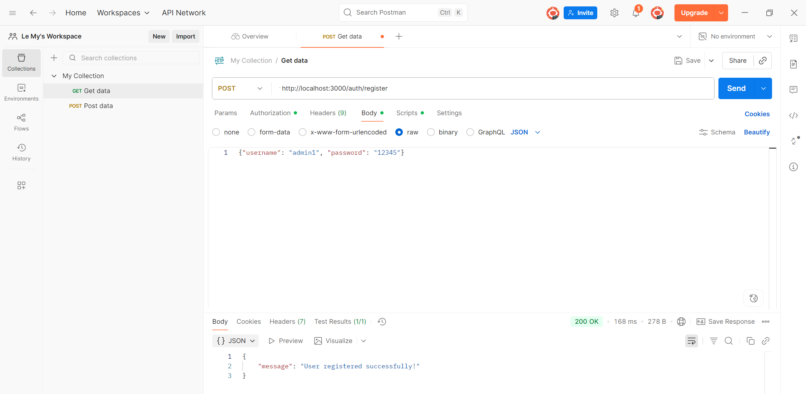
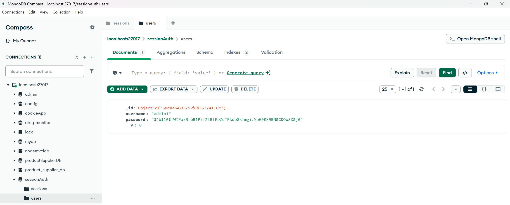
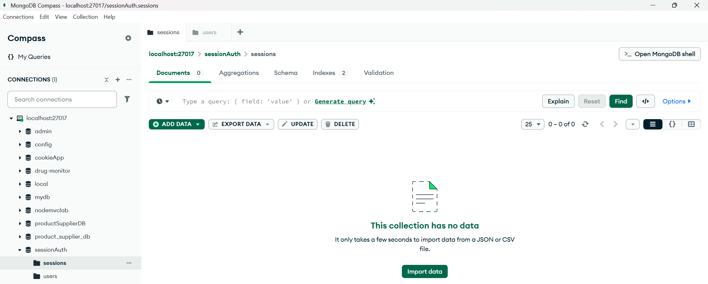
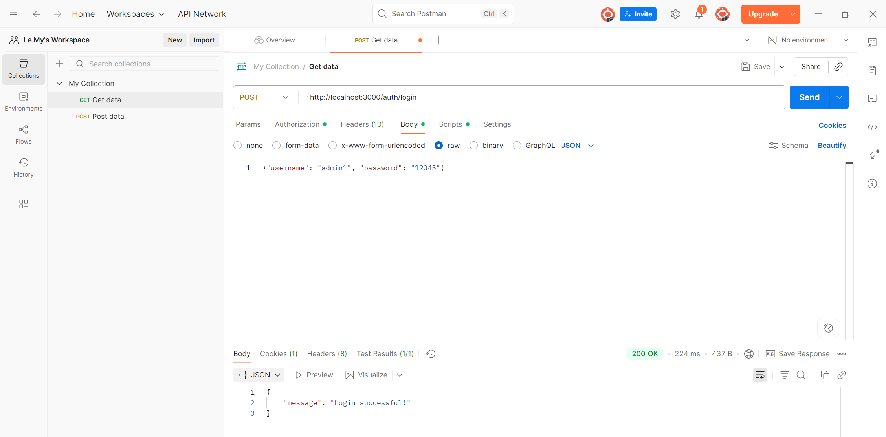
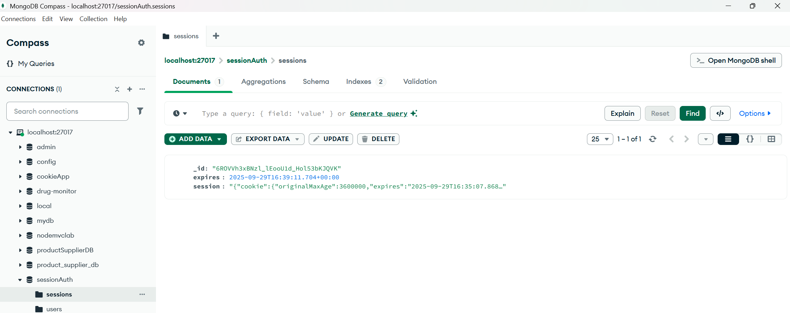
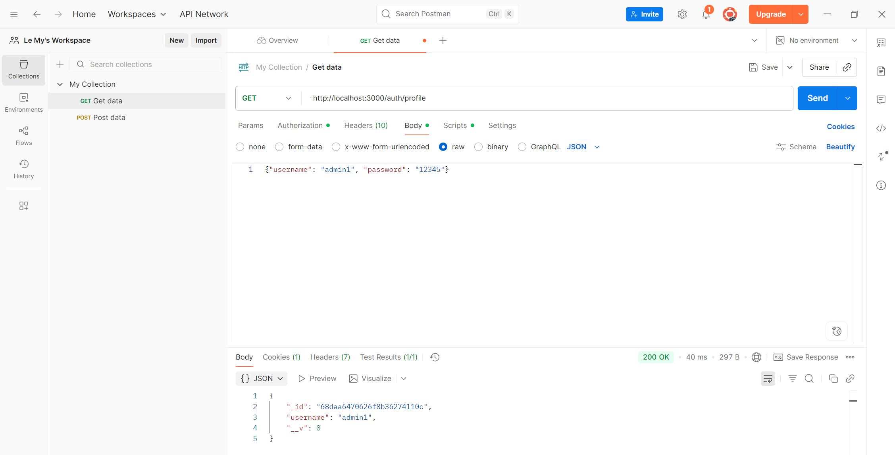
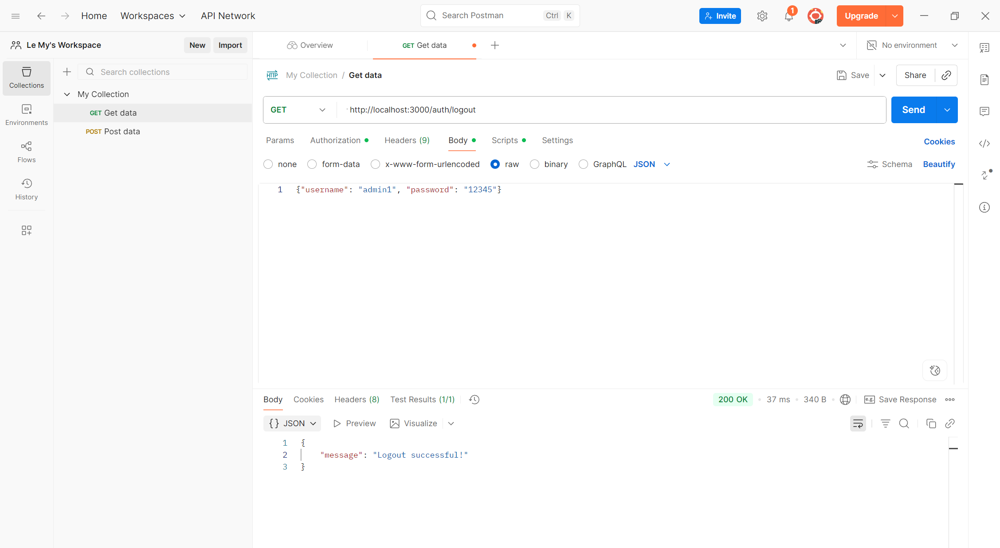

#Cookie Session Authentication

Dự án này minh họa cách triển khai authentication với cookie và session trong Node.js.

Các chức năng chính bao gồm:

a. Đăng ký người dùng (Register)
b. Đăng nhập (Login)
c. Truy cập trang hồ sơ (Profile)
d. Đăng xuất (Logout) và kiểm tra cookie đã bị xóa trong database

---
## Cài đặt
```bash
git clone <https://github.com/LeHoangMy063/cookie_session_auth.git>
cd cookie_session_auth
npm install
```
## Chạy server

node app.js

Server mặc định chạy ở http://localhost:3000

## a.Register
1. Tạo một REQUEST mới

2. Ở phần METHOD

- POST: `http://localhost:3000/auth/register` 

Body (JSON): { "username": "admin1", "password": "123456" } -> Send

Ảnh test:


Kết quả: { "message": "User registered successfully!" }

3. Check in database

Vào mongodb:

sessionAuth -> users



sessionAuth -> sessions



## b. Login

1. Tạo một REQUEST mới

2. Ở phần METHOD

- POST: `http://localhost:3000/auth/login` 

Body (JSON): { "username": "admin1", "password": "123456" } -> Send

Ảnh test:


Server tạo session + cookie lưu trong DB.

3. Check in database

Vào mongodb:

sessionAuth -> sessions



## c. Profile

Yêu cầu: Gửi kèm cookie (được tạo sau khi login).

- GET: `http://localhost:3000/auth/profile`

Body (JSON): { "username": "admin1", "password": "123456" } -> Send



## d. Logout

- GET: ` http://localhost:3000/auth/logout`

Body (JSON): { "username": "admin1", "password": "123456" } -> Send


